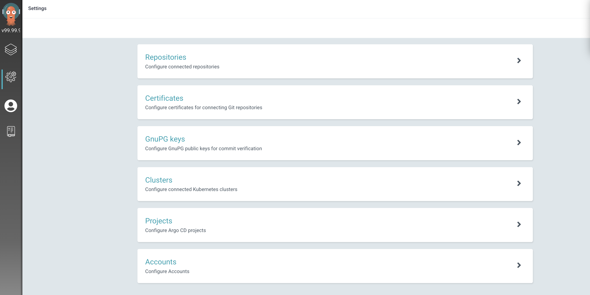
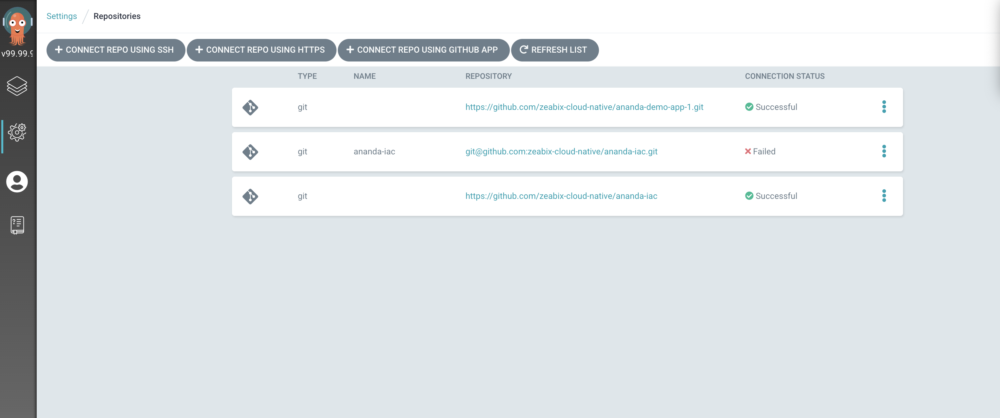
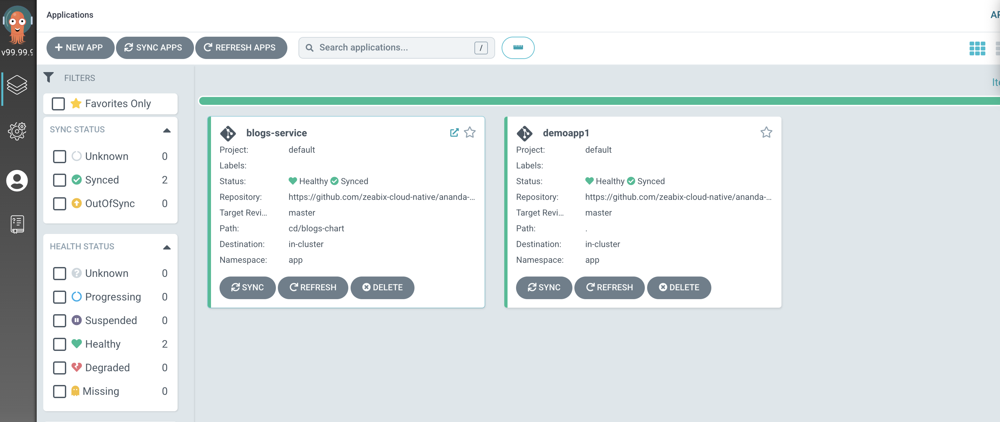

# Deploy the Application to AKS using ArgoCD
## Setup Helm Chart for Service
```sh
$ helm create blog-chart
```
`values.yaml`
```yaml
# Default values for blogs-chart.
# This is a YAML-formatted file.
# Declare variables to be passed into your templates.

replicaCount: 1

image:
  # Docker image repository 
  repository: anandaacr.azurecr.io/blog-service
  pullPolicy: IfNotPresent
  # Overrides the image tag whose default is the chart appVersion.
  tag: "v1.0.0"

imagePullSecrets: []
nameOverride: ""
fullnameOverride: ""

serviceAccount:
  # Specifies whether a service account should be created
  create: false
  # Annotations to add to the service account
  annotations: {}
  # The name of the service account to use.
  # If not set and create is true, a name is generated using the fullname template
  name: ""

podAnnotations: {}

podSecurityContext: {}
  # fsGroup: 2000

securityContext: {}
  # capabilities:
  #   drop:
  #   - ALL
  # readOnlyRootFilesystem: true
  # runAsNonRoot: true
  # runAsUser: 1000

service:
  type: ClusterIP
  port: 80

ingress:
  enabled: true
  className: ""
  annotations: 
    kubernetes.io/ingress.class: "nginx"
    nginx.ingress.kubernetes.io/ssl-redirect: "true"
    nginx.ingress.kubernetes.io/auth-tls-verify-client: "on"
    nginx.ingress.kubernetes.io/auth-tls-secret: "app/ingress-secret-self"
    nginx.ingress.kubernetes.io/whitelist-source-range : "20.198.210.67/32"
  hosts:
    - host: blog.z-unified.com
      paths:
        - path: /
          pathType: ImplementationSpecific
  tls: 
   - hosts:
        - blog.z-unified.com
     secretName: ingress-secret-dev 

resources:
  limits:
    cpu: 100m
    memory: 128Mi
  requests:
    cpu: 100m
    memory: 128Mi

autoscaling:
  enabled: false
  minReplicas: 1
  maxReplicas: 100
  targetCPUUtilizationPercentage: 80
  targetMemoryUtilizationPercentage: 80

nodeSelector: {}

tolerations: []

affinity: {}

app_env:
  mongo_url: "mongodb://mongodb.db.svc.cluster.local:27017"
  mongo_db_name: "blogs"
  mongo_collection_name: "blogs"


```
***Push it to git repoitory***

## ArgoCD
To run access server ArgoCD run this commands
```sh
$ kubectl port-forward svc/argocd-argo-cd-server -n argocd 8080:443
```
default Username is `Admin` , Argo CD server admin password. Autogenerated by default.
run this commands to get password
```sh
$ kubectl -n argocd get secret argocd-secret -o jsonpath="{.data.clearPassword}" | base64 -d
```

1. go to `https://localhost:8080`
2. Login to `ArgoCD Dashboard`
3. go to manage repository and setting page -> Repository


4. Setup git reposity which helm chart are store in this case (https://github.com/zeabix-cloud-native/ananda-iac)


5. Go to Manage Application Page -> + New APP
[General]
  - Define Application Name 
  - Project Name set `Default`
[Source]
  - Define Git Repositoy
  - Choose Revision
  - Define Path that store helm chart (blog-chart) 
  - Define Name space
  - `Create` Application
  
6. Follow previos step Appication,Deploment,Ingress will create and Comunication betwenn client and server will use `mTLS`   
